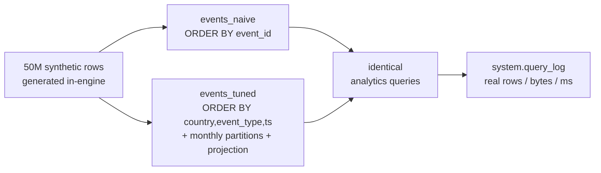
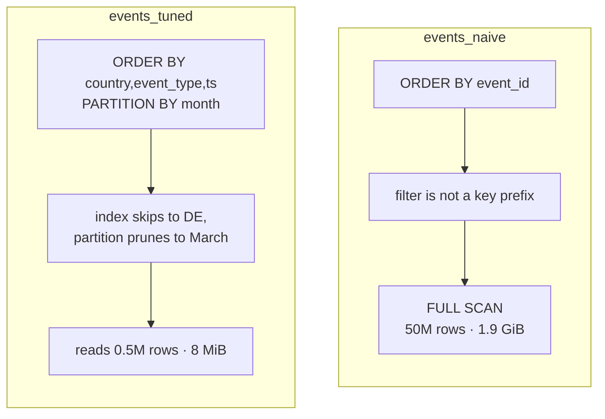
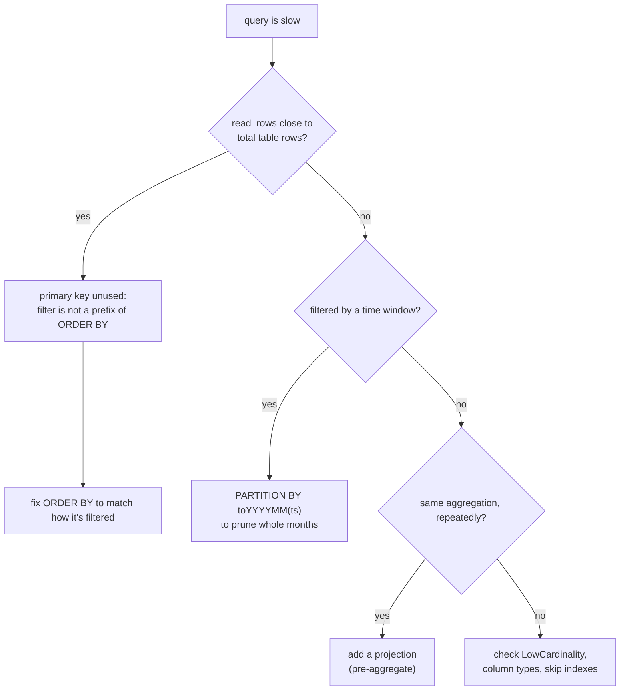

# Same 50M-row events table, two ClickHouse schemas — with the numbers

A small, **runnable** demo of ClickHouse schema design and query tuning. Same
50 million synthetic rows, loaded two ways: the naïve schema most teams write
first, and a tuned one. Then the identical analytics queries on both, with the
real `read_rows` / `read_bytes` / duration pulled from `system.query_log`.

No real data, no credentials — everything is generated in-engine (**mock-first**),
and the whole thing rebuilds from empty with one command:

```bash
./run_demo.sh
```



## The numbers (single-node ClickHouse 24.3, Docker; reproduce with the script)

| Query | Naïve | Tuned | What made the difference |
|---|---|---|---|
| **Q1** — filter `country + event_type + month`, aggregate | 127 ms · **1.97 GiB** scanned | 8 ms · **8.72 MiB** | `ORDER BY (country, event_type, ts)` — **16× faster, ~230× less data read** |
| **Q2** — 3-month revenue-by-country window | 96 ms · 1.07 GiB | 34 ms · 306 MiB | `PARTITION BY toYYYYMM(ts)` prunes 3 of 6 months — **2.8× faster** (honest: no country filter, so only pruning helps) |
| **Q3** — daily rollup over the whole table | 967 ms · 1.78 GiB | 18 ms · 6.92 MiB | a **projection** serves the pre-aggregate — **54× faster, ~260× less read**, for +1 MiB storage |

Bonus, before any query runs: the tuned table is **1.03 GiB vs 1.24 GiB** at rest — `LowCardinality` dictionary-encodes the string columns.

The honest metric here isn't the milliseconds (those move with cache) — it's the
**bytes scanned**, which is deterministic. Q1 reads 230× less; that's the number
that holds under load and on real hardware.

Why the tuned table reads so much less on Q1 (`country='DE'`, March):



## Problem → Constraint → Solution → Proof

- **Problem.** A naïve ClickHouse table full-scans on every analytics query. It "works" at small scale and quietly falls over as the table grows — the classic first-ClickHouse-project failure.
- **Constraint.** The tuning logic must be provable without touching any real data or credentials. So the data is synthetic, generated in-engine, and the demo runs from empty on any machine with Docker.
- **Solution.** Three levers, each mapped to a real query pattern:
  - **`ORDER BY` = how analysts actually filter** (`country, event_type, ts`), not a surrogate id. This is the whole game for Q1.
  - **`PARTITION BY toYYYYMM(ts)`** so time-windowed queries skip whole months (Q2).
  - **A projection** for the repeated daily rollup, so Q3 reads a pre-aggregate instead of 50M rows.
  - **`LowCardinality`** on the low-cardinality strings — smaller at rest and faster to group.
- **Proof.** `system.query_log` numbers above, reproducible with `./run_demo.sh`. A GitHub Actions job (`.github/workflows/ci.yml`) re-runs it on every push and **fails the build** if the tuned query ever scans more than 5% of what the naïve one does — the optimization is guarded, not a one-time screenshot.

## What's here

```
sql/01_schema.sql   naïve vs tuned table definitions (commented with the why)
sql/02_load.sql     50M synthetic rows, mock-first
sql/03_tune.sql     the daily-rollup projection
run_demo.sh         one command: up → load → tune → benchmark → print
docker-compose.yml  single-node ClickHouse
RUNBOOK.md          "a dashboard got slow" triage + SLI/SLO I'd wire to Grafana
.github/workflows/  CI that proves the tuning and guards against regressions
```

## How I approach a slow ClickHouse query

The three fixes above aren't guesses — they come from one triage loop. `read_bytes`
tells you *which* lever before you touch anything (also in `RUNBOOK.md`):



## Honest scope

Single-node, synthetic data, three representative queries. It demonstrates the
schema-design / partitioning / projection / `LowCardinality` decisions and how to
*prove* them with `query_log` — not a full production cluster (that's replication,
sharding, ingestion back-pressure, and the monitoring in `RUNBOOK.md`, which I'm
happy to walk through). The point is the method and the measurement, shown end to end.
